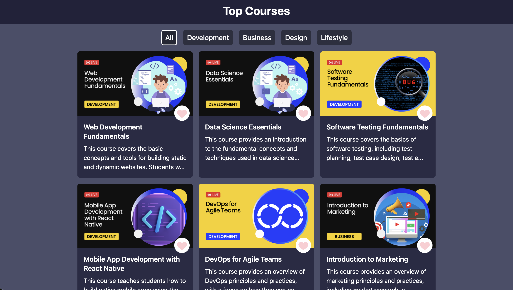
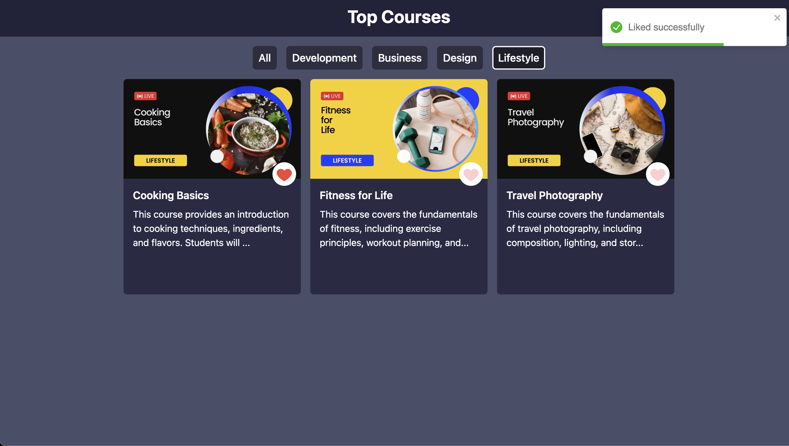

# Top Courses

## Overview
Top Courses is a React-based web application designed to help users discover and explore a curated list of courses. The application fetches course data from an API, categorizes them by topic, and provides a user-friendly interface for seamless navigation.

## Features
- Filtering: Easily explore courses by selecting specific categories of interest.
- Liking Courses: Users can mark their favorite courses, with liked courses visually highlighted using a like icon.
- Responsive Design: Ensures a consistent and enjoyable user experience across various devices.

## Screenshots
()

## Dependencies
- react-toastify: Used for displaying notifications (success, warning) related to liking or removing likes from courses.
- react-icons: Utilized for incorporating like and dislike icons.

## How to Run
- Clone the repository: `https://github.com/NamanAnand13/top-course-starter.git`
- Install dependencies using `npm install`.
- Run the application using `npm start`.
- Open the application in a web browser.
- Note: An internet connection is required for data fetching from the API.

